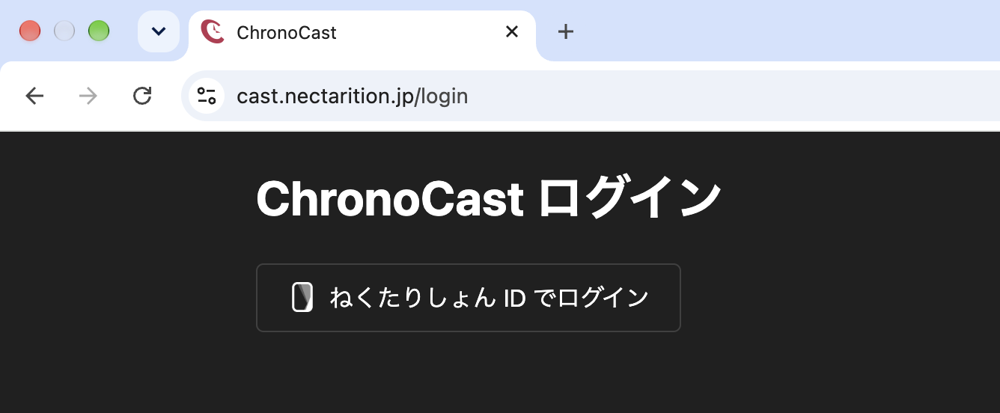
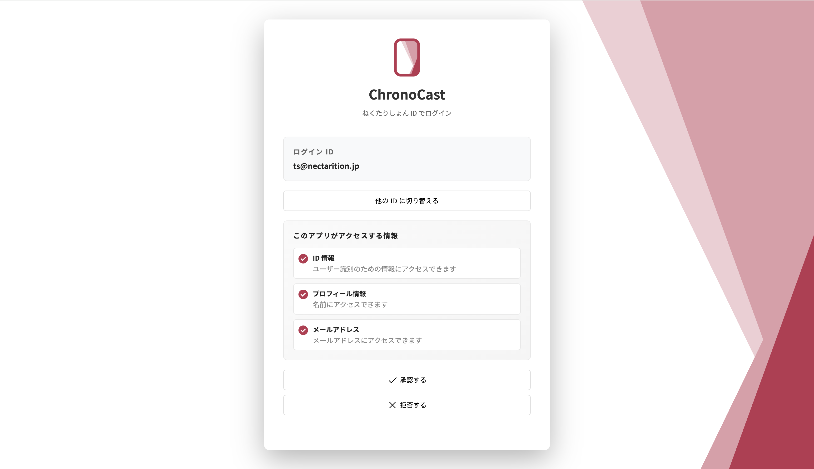
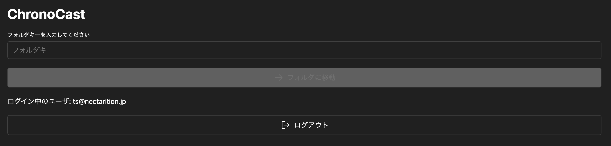
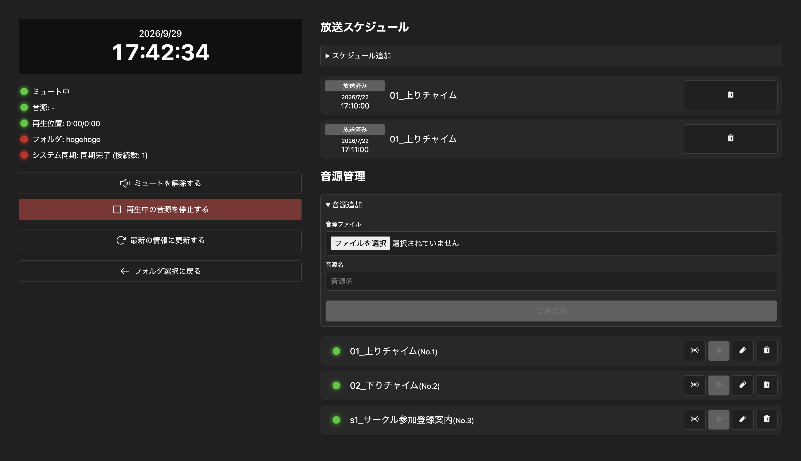
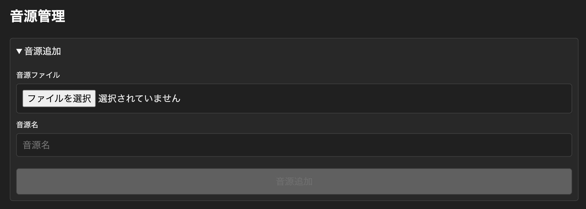
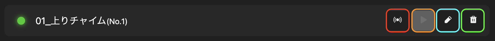
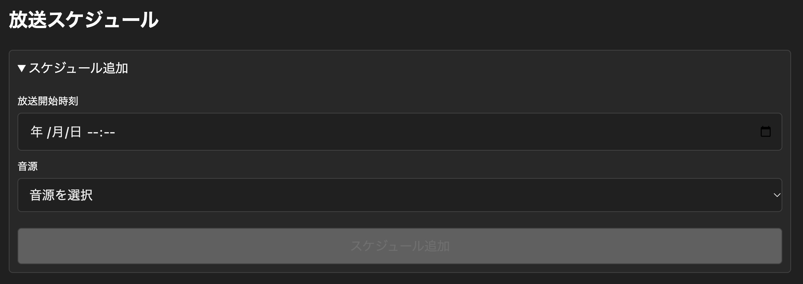
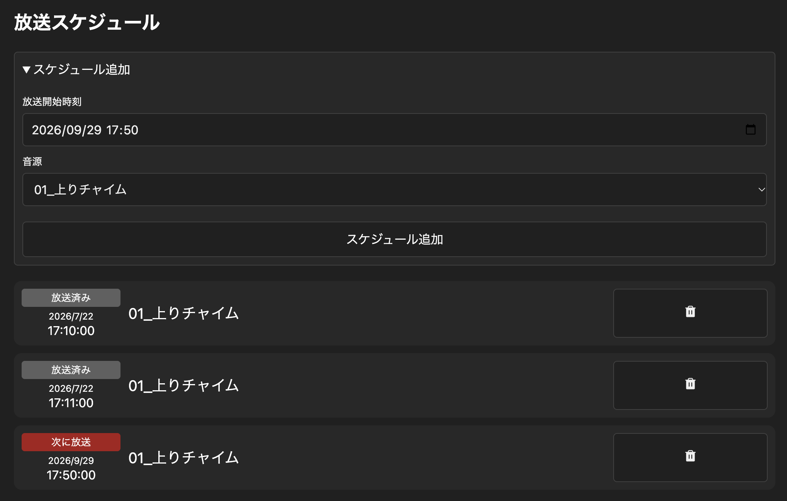
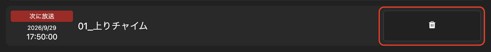
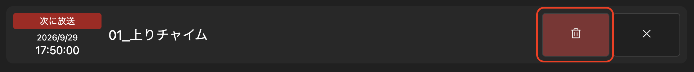

イベントで ChronoCast を利用する前に、以下の準備を行ってください。

## ハードウェアの準備

### 1. インターネット接続を確認する

ChronoCastの利用にはインターネット接続が必要です。  
安定したインターネット接続を確保できる環境であることを確認してください。

### 2. 音源送出端末を用意する

会場の音響設備に接続し、音声を再生する端末を用意します。  
Windows、macOS、Android、iOS のいずれかの端末を利用できます。

:::caution
送出端末では、ChronoCast を開いたままにする必要があるため、端末の設定でスリープや自動ロックを無効にしておいてください。
:::

### 3. 操作端末を用意する

放送の操作を行う端末を用意します。  
遠隔操作の必要がなければ、操作端末を用意する必要はありません。

## 音源の準備・設定

### 1. 音源を用意する

音源として使用するファイルを用意します。  
音源送出端末の OS で再生可能な形式の音源ファイルを用意してください。

:::tip
mp3 形式で、ステレオからモノラルにミックスダウンした音源ファイルを用意することをおすすめします。
:::

### 2. ChronoCast に音源を追加する

#### 2.1. ChronoCast にログイン

[ChronoCast](https://cast.nectarition.jp/) にアクセスし、ねくたりしょん ID でログインします。

:::caution
ChronoCast の利用には、管理者による利用申請が必要です。
:::

#### 2.2. フォルダ ID を入力する

利用申請時に指定されたフォルダ ID を入力します。

▼フォルダ選択後の画面

#### 2.3. 音源を追加する

「音源管理」セクションの「音源追加」を開き、「音源ファイル」から音源ファイルを選択し、「音源名」を入力して追加します。

#### 2.4. 音源の確認

追加した音源が正しく表示されていることを確認します。  
必要に応じて、音源を再生して内容を確認します。

:::tip
音源を再生するときは、左の操作パネルから「ミュートを解除する」をクリックしてください。
:::

##### 音源情報の操作説明

* 赤: 一斉放送ボタン (同期中の全端末で再生する)
* オレンジ: 音源確認ボタン (操作中の端末のみで再生する)
* 青: 音源名編集ボタン (音源名を編集する)
* 緑: 音源削除ボタン (音源を削除する)

### 3. 放送スケジュールを設定する

#### 3.1. 放送スケジュールの追加

音源を追加すると、放送スケジュールを設定できるようになります。  

放送したい音源と時間を設定し、「スケジュール追加」をクリックします。

追加が完了すると、設定した放送スケジュールが一覧に表示されます。

#### 3.2. 放送スケジュールの削除

放送スケジュールを削除するには、一覧から削除したいスケジュールを選択し、ゴミ箱マークをクリックします。

破壊的操作のため、削除の最終確認が求められます。  

赤い背景のボタンをクリックすると、削除が確定します。  
削除をキャンセルする場合は、×マークをクリックします。

