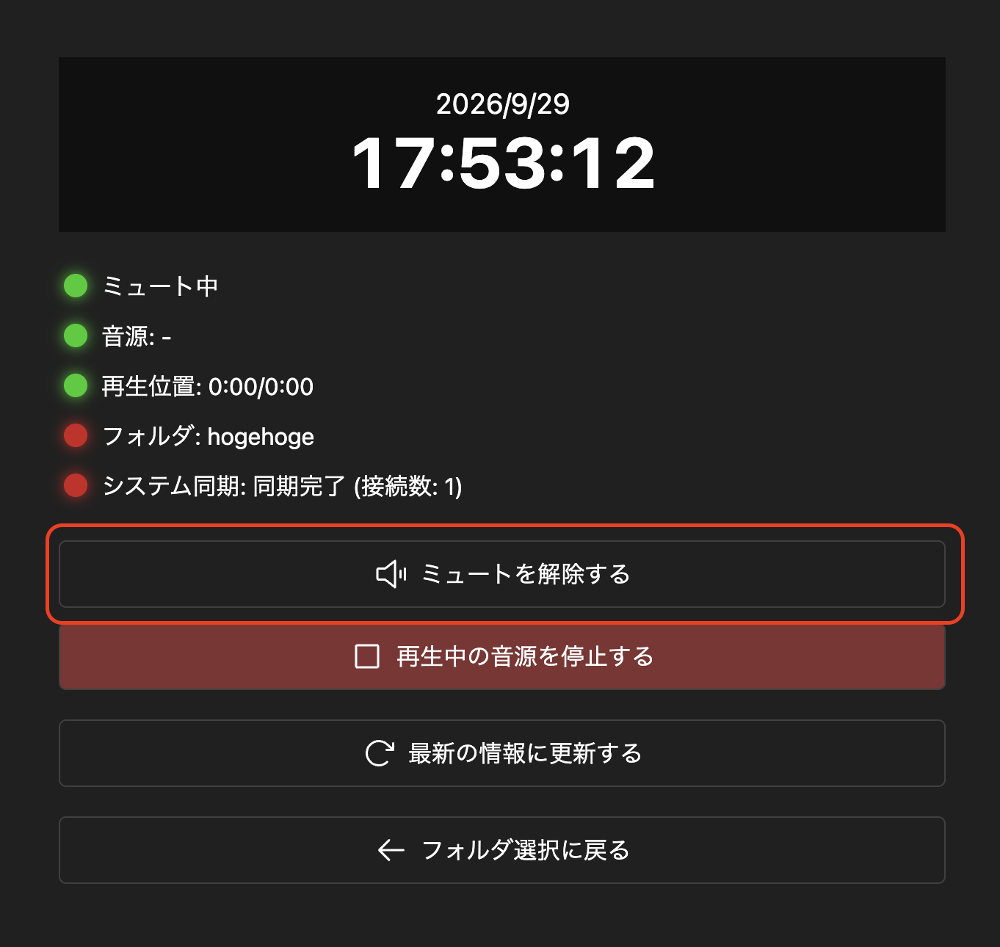

イベント当日は、以下の手順でChronoCastを利用します。

## 1. 音源送出端末の準備

### 1.1. 音源送出端末を会場の音響設備に接続する

音源送出端末を会場の音響設備に接続します。  
また、音源送出端末の音が会場の音響設備から出力されることを確認します。

### 1.2. ChronoCast を起動する

[事前準備](prepare.md) と同様に、ChronoCast にログインし、フォルダ ID を入力して、フォルダ選択を行います。

### 1.3. ChronoCast のミュートを解除する

ChronoCast のミュートを解除します。  
ミュートを解除することにより、ChronoCast の音声が会場の音響設備に出力されるようになります。

### 1.4. 手動でテスト音源を再生する (推奨)

テスト音源を準備している場合、手動で再生して、会場の音響設備から音が出力されることを確認します。

## 2. 操作端末を接続する

音源送出と操作を同じ端末で使用する場合は、この手順は必要ありません。

### 2.1. ChronoCast を起動する

別の端末から操作する場合も、音源送出端末と同様に、操作端末で ChronoCast にログインし、フォルダ ID を入力して、フォルダ選択を行います。

### 2.2. 同期が行われていることを確認する

左の操作パネルの「システム同期」の項目に、現在接続している端末の数が表示されます。  
接続している端末の数が、想定通りであることを確認してください。

### 2.3. 手動でテスト音源を再生する (推奨)

操作端末から「一斉放送ボタン」をクリックして、手動でテスト音源を再生します。  
接続している音源送出端末・会場の音響設備から音が出力されることを確認します。

## 3. スケジュール放送のテストを行う (推奨)

テスト用のスケジュールを追加し、定刻通りに会場の音響設備から音が出力されることを確認します。

## 4. 放送を開始する

放送画面からイベントの放送を開始します。  
設定したスケジュールに従って、定時放送が自動的に送出されます。  
必要に応じて、操作端末から放送を手動で操作できます。
