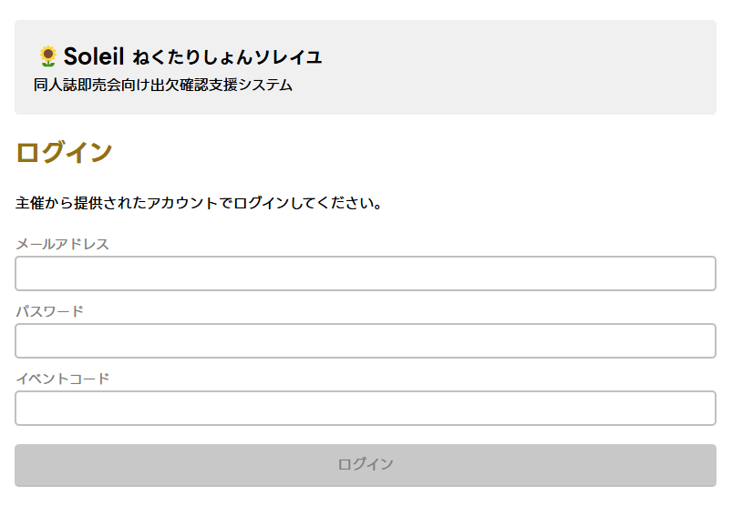
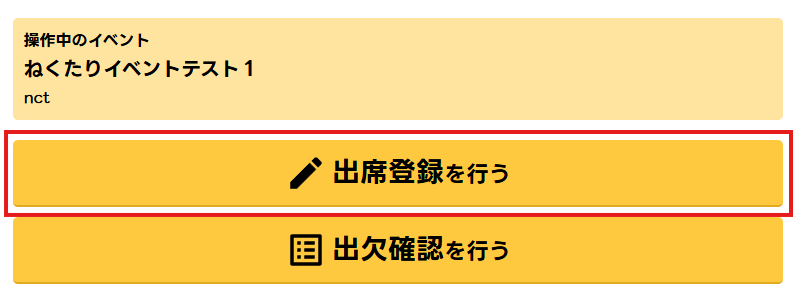
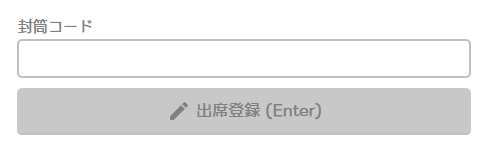
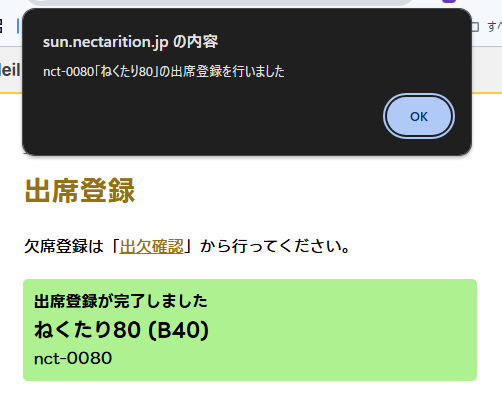

このページでは「参加登録 (出席登録)」を行う方法を記載しています。

**欠席**登録を含む[「出欠確認」](./rollcall)は別のページで解説しているのでそちらをご覧ください。

## 出席登録の方法

### ログイン・出席登録画面を開く

1. [Soleil](https://sun.nectarition.jp/login) にアクセスします
1. 主催から提供された認証情報を使用しログインしてください

1. 「出席登録を行う」を押下

### QR コード読み取り方法を選択する

Soleil は QR コードの読み取り方法を複数選択できます。

- 推奨: ソフトウェア QR リーダ
- Web カメラやスマートフォンやタブレットのカメラを使用する方法
- ハードウェア QR リーダ
- 外付け QR コードリーダなどから入力する方法
- キーボード直接入力
- キーボードから直接入力する方法

#### 推奨: ソフトウェア QR リーダ

「ソフトウェア QR リーダを開く」を押下して使用してください。

カメラが起動している間は電池消耗が激しいため、「ソフトウェア QR リーダを閉じる」を押下するなどして適宜リーダーを閉じるようにしてください。

#### ハードウェア QR リーダ

「ハードウェア QR リーダを使用する」を押下して使用してください。

ハードウェア QR リーダを使用する場合は、外付けデバイス側でコード読み取り後に「Enter」キー入力を行う設定を有効にしてください。

#### キーボード直接入力

「封筒コード」欄に封筒コードを直接入力してください。

入力後は「出席登録 (Enter)」を押下することにより出席を登録できます。

### 出席登録

出席登録が完了すると、ダイアログと緑のモーダルが表示されます。

:::tip
出席登録が正常に完了・エラーが発生した際は効果音が再生されます。  
端末がサイレントモードになっている場合は再生されませんので、適宜切り替えてください。
:::

## 出席登録の取り消しについて

「出席登録を行う」画面から取り消しを行うことはできません。

取り消し操作は主催権限が必要となりますので、随時主催または当日のシステム管理担当者へご連絡ください。
