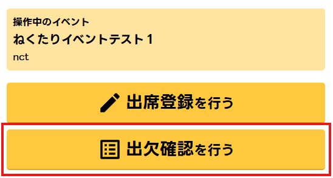
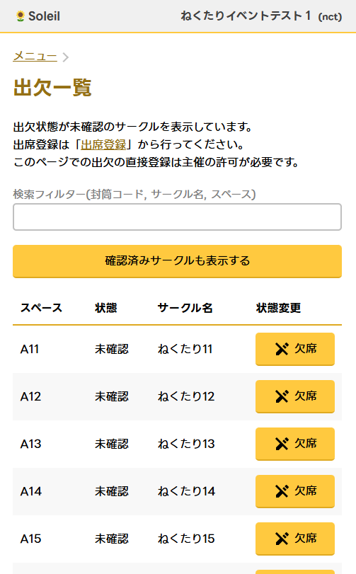

このページでは「出欠確認」を行う方法を記載しています。

当日の参加登録窓口 (見本誌提出窓口) で行う「[「出席登録」](checkin)は別のページで解説しているのでそちらをご覧ください。

## 出欠確認の方法

### ログイン・出欠確認画面を開く

1. [Soleil](https://sun.nectarition.jp/login) にアクセスします
1. 主催から提供された認証情報を使用しログインしてください

1. 「出欠確認を行う」を押下

### 出欠確認を行う

出欠一覧を開くと、最初の画面で**出席登録が行われていない**サークルの一覧が表示されます。

スペースを訪問しサークル参加者に参加登録 (見本誌提出) を促してください。

サークル参加者が不在の場合は何もしなくて構いません。

イベント終了直前に再度スペースを巡回し、欠席であることが確定したら部署統括を経由してイベント主催にその旨を報告してください。

:::danger
欠席登録はクリティカルな操作であるため、主催が承認した場合のみ行えます。
:::

## 便利な機能

「確認済みサークルも表示する」を押下すると、出席登録済みのサークルを含めて表示することができます。
